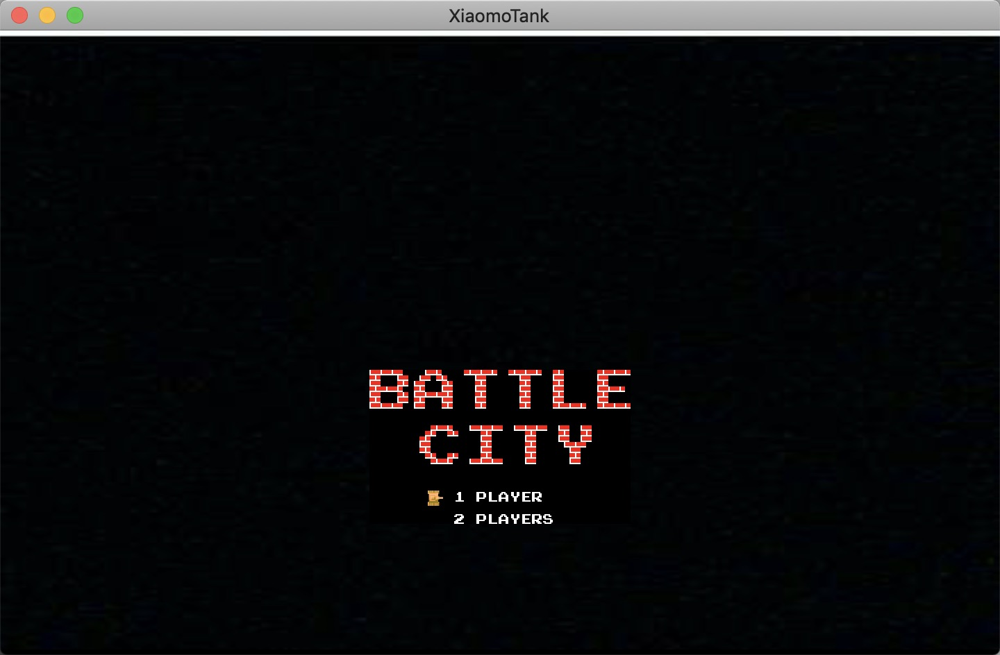
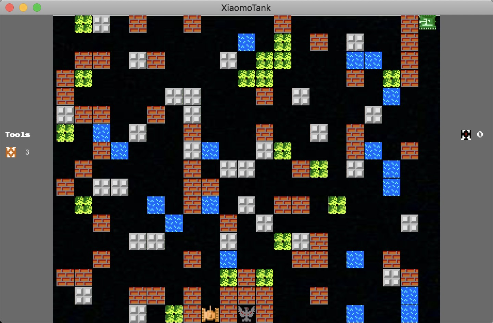

# 坦克大战
- 使用unity2018.2.13f1版本 + rider2018.2 开发
- 使用了dotween插件
- 2d的UGUI
- 网络上搜集的素材
- 目前只支持单人模式，双人模式还在开发中。

## 1. 效果图

## 2. 操作说明

选择：
- w或↑ 向上
- s或↓ 向下
- 回车 开始游戏

player1:    
- w 向上
- s 向下
- a 向左
- d 向右
- j 攻击

player2（开发中）:    
- ↑ 向上
- ↓ 向下
- ← 向左
- → 向右
- 回车 攻击

## 3. 视频效果
[bilibili游戏效果演示](https://www.bilibili.com/video/av34756631/)

## 4. 后续计划
- 双人模式
- 敌人坦克类型增加
- 不同敌人攻击力不同
- 带特效的敌人打死奖励道具
- 道具生效及搭配UI